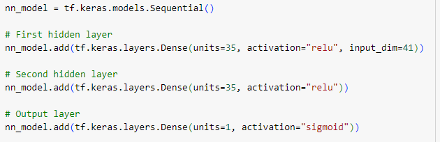
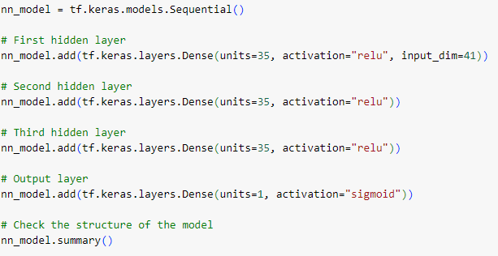

**DEEP LEARNING CHALLENGE**

**(1) Project Overview and Purpose:**

Alphabet Soup (A/S), a non-profit organization, is interested in leveraging its historical funding data over 34,000 organizations they’ve funded over the years. The request is to use this information to build a tool that will help AS select the applicants for funding with the best chance of success in future ventures. This tool will be created based on knowledge of machine learning and neural networks.

**(2) Dataset Description:**

The dataset was available for this exercise via a .csv file. The file is stored online at https://static.bc-edx.com/data/dl-1-2/m21/lms/starter/charity_data.csv". Code within the Jupyter Notebook files reads the .csv file and makes the data available for use.

**(3) Data Cleaning and Preprocessing:**

(a) Preprocessing of the data occurred after reading the .csv file. Steps included-

(i) dropping unnecessary columns

(ii) determining unique values

(iii) recategorizing data (i.e., creating an "Other" bin via cut off value)

(iv) converting ategorical data to numeric via pd.get_dummies

(b) Splitting data into features and target arrays

(c) Scaling data via StandardScaler

**(4) Data Visualization Techniques:**

No plots; graphs; maps; etc. were generated for this exercise.

**(5) Results and Analysis:**

RESULTS-

(a) Data Preprocessing:

(i) What variable(s) are the target(s) for your model?

For modeling, the target was information contained in a column called “IS_SUCCESSFUL”, which contains binary (0 or 1) information on whether the money used effectively

(ii) What variable(s) are the features for your model?

STATUS; ASK_AMOUNT; APPLICATION_TYPE; AFFILIATION; INCOME_AMOUNT; and SPECIAL_CONSIDERATIONS

(iii) What variable(s) should be removed from the input data because they are neither targets nor features?

EIN; NAME; CLASSIFICATION; USE_CASE; and ORGANIZATION

(b) Compiling, Training, and Evaluating the Model:

(i) How many neurons, layers, and activation functions did you select for your neural network model, and why?

My initial model had 3 layers (35 neurons, 35 neurons, and 1 neuron) using RELU 
as my activation function for two layers and SIGMOID for the last, with 100 Epochs

(ii) Were you able to achieve the target model performance?

The initial model did not meet model performance, as the Accuracy was calculated at 0.7332 and the Loss calculated at 0.5586.

(iii) What steps did you take in your attempts to increase model performance?

Initial model-

The first modification was to increase the number of Epochs to 200, but this lowered the Accuracy score to 0.7297 and increased the Loss to 0.5839.

Subsequently, for the second modification, the number of Epochs was returned to 100 and a fourth layer of 35 neurons (with RELU) was added. The Accuracy score finished 0.7300 and Loss equaling 0.5648.

Finally, the last modification, returned the model to 3 layers (35 neurons, 35 neurons, and 1 neuron) and changed the activation functions to SIGMOID for all layers. The Accuracy score finished as 0.7306, with Loss equaling 0.5525.

SUMMARY

This tool was proposed to help understand if any insight could be gleaned from historical information. Each iteration (original and three modifications) did not reach the requested threshold of 75%. 

While having this data available is advantageous, there might need to be discussed about whether other information A/S has can augment this model further. Benefit may also result from my detailed review of each column’s information to ensure it should be included in the tool’s set up.

In data preprocessing, two columns (APPLICATION_TYPE and CLASSIFICATION) were given arbitrary cut offs. This could impact the model in terms of the configuration of the data fed into the model. Additional thought on these cut off values might prove to be beneficial in future iterations of the tool.

**(6) Ethical Considerations:**

(Discuss any ethical considerations taken into account during the project, such as data privacy, bias, or fairness)

**(7) Instructions for Interacting with the Project:**

(Provide clear instructions on how to interact with the visualizations, such as how to run the code or access the visualizations)

**(8) References:**

use the features in the provided dataset to create a binary classifier that can predict whether applicants will be successful if funded 
